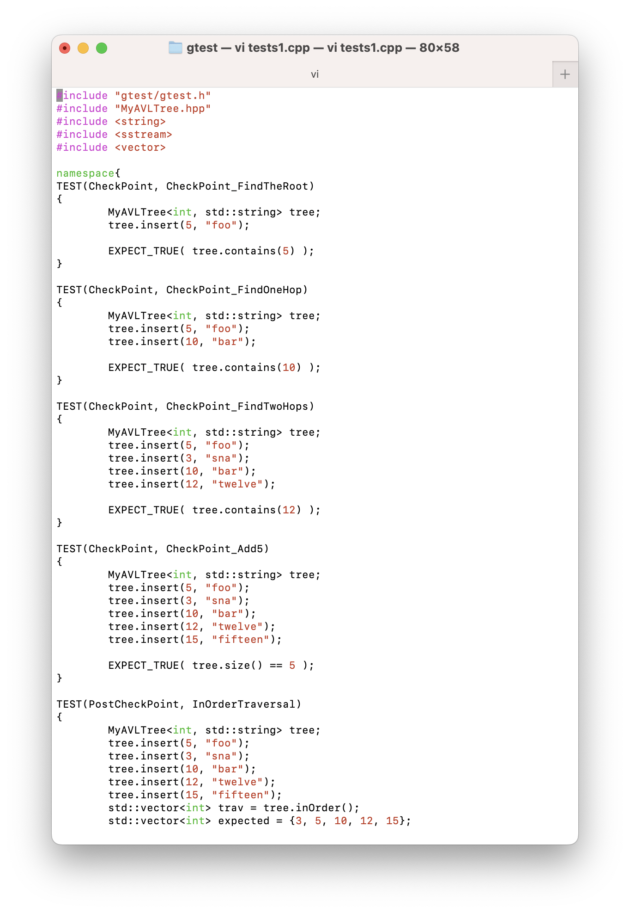
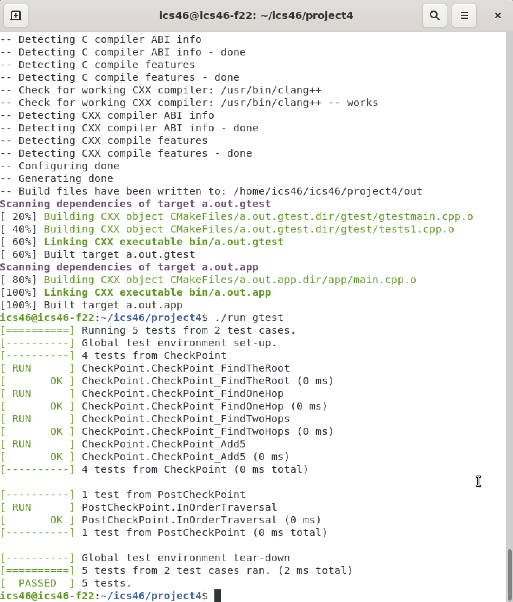

### Description 

This project is about creating an AVL tree which has the property of an binary seach tree and a balanced tree. After insert or remove a new node from the tree, the tree will rebalance itself. 

### Screenshots

